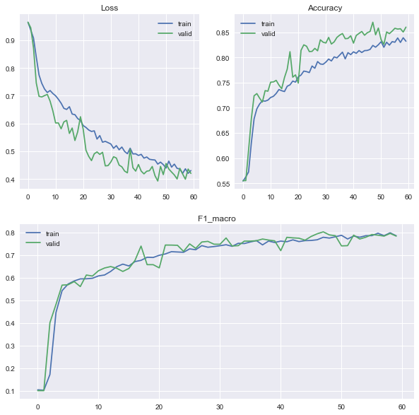
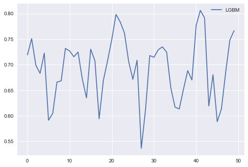

# 第三届阿里云磐久智维算法大赛 - 基于大规模日志的故障诊断

> 赛题：**基于大规模日志的故障诊断**
>
> 任务：给定一段时间的系统日志数据，参赛者应提出自己的解决方案，以诊断服务器发生了哪种故障。
>
> 官网链接：https://tianchi.aliyun.com/competition/entrance/531947/introduction
>
> 成绩：254/1757

## 赛题理解

题目要求根据报错时间点判断当前服务器发生了哪种故障，给定故障类别共有四类，其中0类和1类代表CPU相关故障，2类代表内存相关故障，3类代表其他类型故障。根据常识可知，发生故障时，只有前一小时或者前一天的日志信息是有效的，因此需要规定一个窗口W，来划分数据集。对于该W条数据，产生如下两种选择：

- 将W条信息合并成一条，再进行Embedding。 
- 将每条信息分别Embedding，生成[W, Embedding]维度的时间序列向量。

经过经典机器学习方法训练后，发现0类和1类的数据无法完全分开，但是2类和3类的分类效果非常显著。因此，选择先进行三分类后进行二分类。

- 在三分类任务中使用LSTM网络进行分类
- 在二分类任务中使用开源的Drain3日志模板进行文档的模板匹配，再通过随机森林进行分类

赛题使用Macro F1-score评价指标，各分类的权重以及评价函数如下：
$$
w=\{ \frac{3}{7}, \frac{2}{7}, \frac{1}{7}, \frac{1}{7} \} \\
Macro \ F1-score=\sum_{i \in \{ 0,1,2,3 \}} w_i \times F1-score_i
$$
因此，区分0类和1类是取得高分的关键。

本方案虽然可以很高的实现三分类，但是在二分类上依旧无法取得进展。

可行的改进方案：

- 有使用Bert的baseline，效果略有提升
- 添加Attention机制

## 实验结果

### 第一阶段三分类任务

```shell
## 模型结构
_________________________________________________________________
Layer (type)                 Output Shape              Param #   
=================================================================
lstm_4 (LSTM)                (None, 8, 256)            467968    
_________________________________________________________________
lstm_5 (LSTM)                (None, 8, 256)            525312    
_________________________________________________________________
lstm_6 (LSTM)                (None, 256)               525312    
_________________________________________________________________
dense_3 (Dense)              (None, 128)               32896     
_________________________________________________________________
dense_4 (Dense)              (None, 3)                 387       
=================================================================
Total params: 1,551,875
Trainable params: 1,551,875
Non-trainable params: 0
_________________________________________________________________
```



### 第二阶段二分类任务

```python
## 模型结构
RandomForestClassifier(criterion='entropy', oob_score=True, random_state=2022)
```



## 开始使用

1. 下载并且解压`FaultDiagData&Model.zip`到当前文件夹，该文件包括训练数据，预处理的数据numpy文件，以及训练号的model文件。链接: https://pan.baidu.com/s/1TcQ505qaMa1C4CP9a7KJlQ?pwd=z1yx

2. 安装`requirement.txt`中的环境

3. nltk安装punkt工具包

   ```python
   # 有如下两种方法
   
   ## 1. 使用python直接下载
   nltk.download('punkt')
   
   ## 2.1 去官网下载 Punkt Tokenizer Models，位于第70个
   http://www.nltk.org/nltk_data/
   ## 2.2 下载完成后解压至
   anaconda3/lib/nltk_data
   ```

4. 使用`1.main.ipynb`完成完整的训练和验证

5. 使用`2.train_template.ipynb`进行第二阶段二分类模板生成
